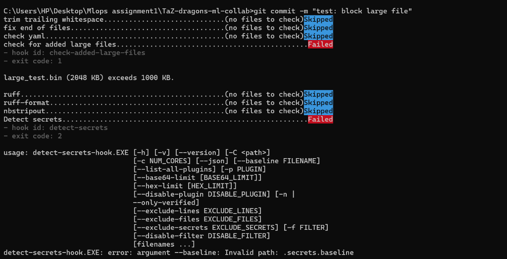
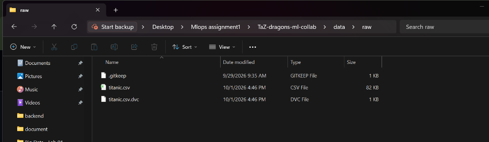

# Assignment 01: Git-Based Collaboration for an ML Project — Final Report

## 👥 Team Overview & Roles
- **Repository URL**: [https://github.com/taaibausman/TaZ-dragons-ml-collab](https://github.com/taaibausman/TaZ-dragons-ml-collab)
- **Team Name**: `TaZ-dragons`
- **Selected Dataset**: Titanic Survival Prediction Dataset ([train_and_test2.csv](file:///c:/Users/HP/Desktop/Mlops%20assignment1/train_and_test2.csv))

| Member | GitHub Handle | Assigned Role | Key Responsibilities |
|---|---|---|---|
| **Zaneeha Afzal** | `@zaneehaafzal` | Data & Platform Co-Owner | DVC data versioning, dataset updates, pre-commit guard rails, data validation checks |
| **Taaiba Usman** | `@taaibausman` | Model & Platform Co-Owner | ML training pipeline, hyperparameter configs, CI workflow, release management |

---

## 📌 Phase 1: Team & Repository Setup
- **Status**: Completed
- **Repository Link**: [https://github.com/taaibausman/TaZ-dragons-ml-collab](https://github.com/taaibausman/TaZ-dragons-ml-collab)
- **Branch Protection**: Branch protection rules enabled on GitHub for `main`, `staging`, and `dev` requiring PR approvals and blocking direct pushes.
- **Collaborator Setup**: Both team members (`@zaneehaafzal` and `@taaibausman`) added with full write access.

---

## 📌 Phase 2: Project Scaffolding & Initial Code Base
- **Status**: Completed
- **Directory Layout**: Cookiecutter Data Science format (`configs/`, `data/`, `models/`, `notebooks/`, `src/`, `tests/`, `.github/`).
- **Environment Pinning**: Pinned dependencies locked in `requirements.txt` and `pyproject.toml`.
- **Branching Setup**: Unidirectional workflow (`dev` $\rightarrow$ `staging` $\rightarrow$ `main`).
- **Initial Commit History (`git log --oneline main`)**:
  ```text
  50a4ee5 feat: add pre-commit hooks for ruff, nbstripout, 1MB limit and detect-secrets
  61d23bb feat: add modular data preparation, training, and evaluation pipeline
  27e2ffa chore: initialize repository scaffold and project configuration
  ```
- **Git Hygiene**: Strict `.gitignore` configured to exclude `.venv/`, `data/raw/*.csv`, `models/*.joblib`, `__pycache__/`, and `.pytest_cache/`.

---

## 📌 Phase 3: Guard Rails (Pre-commit Hooks & Secret Scanning)
- **Status**: Completed (PR Merged)
- **Configuration**: `.pre-commit-config.yaml` configured with:
  - `ruff` (linting & formatting)
  - `nbstripout` (cleans notebook outputs)
  - `check-added-large-files` (max limit: 1 MB / 1000 KB)
  - `detect-secrets` (secret scanner)
- **Author**: Zaneeha Afzal (`feat/pre-commit` branch)
- **Reviewer**: Taaiba Usman

### 📸 Checkpoint Proof: Pre-commit Blocking Large Files & Secrets
Below is the empirical screenshot showing pre-commit intercepting and blocking a 2MB dummy file (`large_test.bin (2048 KB) exceeds 1000 KB`):




---

## 📌 Phase 4: Data Versioning with DVC
- **Status**: Completed (PR Merged)
- **Raw Data Path**: `data/raw/titanic.csv.dvc`
- **Author**: Zaneeha Afzal (`data/initial-dataset` branch)
- **Reviewer**: Taaiba Usman

### 📸 Checkpoint Proof: DVC Tracking Raw Dataset
Below is the screenshot showing the raw dataset `titanic.csv` tracked with DVC alongside its `titanic.csv.dvc` pointer file:




---

## 📌 Phase 5: Notebooks Done Right
- **Status**: Pending
- **Paired Notebook**: `notebooks/01-eda.ipynb` paired with Jupytext (`notebooks/01-eda.py`).
- **Promoted Logic**: `compute_family_size` moved to `src/features.py` with unit tests in `tests/test_features.py`.

---

## 📌 Phase 6: Reproducible Pipeline
- **Status**: Pending
- **Pipeline Stages**: `prepare` $\rightarrow$ `train` $\rightarrow$ `evaluate` defined in `dvc.yaml`.

---

## 📌 Phase 7: Experiments & Multi-Member Collaboration
- **Status**: Pending

### 📊 Experiment Comparison Table (`dvc exp show`)
| Experiment | Branch / Tag | `max_depth` | `n_estimators` | Accuracy | F1 Score | Winner? |
|---|---|---|---|---|---|---|
| Baseline | `dev` | 6 | 100 | 0.7672 | 0.4959 | Baseline |
| *Exp 1* | `exp/taaiba-max-depth` | *TBD* | *TBD* | *TBD* | *TBD* | *TBD* |
| *Exp 2* | `exp/zaneeha-n-estimators` | *TBD* | *TBD* | *TBD* | *TBD* | *TBD* |

---

## 📌 Phase 8: Continuous Integration (GitHub Actions)
- **Status**: Pending
- **Workflow File**: `.github/workflows/ci.yml`

---

## 📌 Phase 9: Reproducibility & Release
- **Status**: Pending
- **Release Tag**: `model-v1.0`

### 🔁 Reproducibility Summary Table
| Metric / Artifact | Value |
|---|---|
| **Release Tag** | `model-v1.0` |
| **Commit SHA** | *TBD* |
| **Data DVC Hash** | *TBD* |
| **Random Seed** | 42 |
| **Final Accuracy** | *TBD* |
| **Final F1 Score** | *TBD* |

---

## 📝 Retrospective & Member Contributions

### Retrospective
*To be completed at the end of the project.*

### Member Contributions
- **Zaneeha Afzal**: *To be completed at project conclusion.*
- **Taaiba Usman**: *To be completed at project conclusion.*
